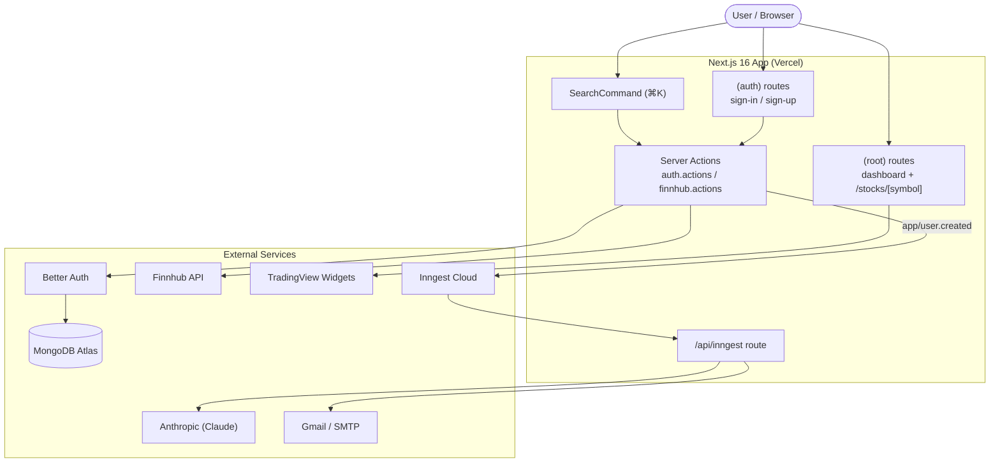

<div align="center">

# 📈 StockLens

**Track real-time stock prices, get personalized alerts, and explore detailed company insights.**

A full-stack stock market dashboard built with Next.js 16, MongoDB, Better Auth, Inngest, and TradingView.

<br/>
<br/>


[](https://nextjs.org/)
[](https://react.dev/)
[](https://www.typescriptlang.org/)
[](https://tailwindcss.com/)
[](https://www.mongodb.com/atlas)
[](https://www.inngest.com/)
[](https://stock-lens-omega.vercel.app/)
[](LICENSE)

**[🚀 Visit Live](https://stock-lens-omega.vercel.app/)** &nbsp;•&nbsp;
**[🐛 Report a Bug](https://github.com/Thinal-Fernando/StockLens/issues)** &nbsp;•&nbsp;
**[✨ Request a Feature](https://github.com/Thinal-Fernando/StockLens/issues)**

</div>

## Table of Contents

- [Overview](#overview)
- [Try It](#try-it)
- [Features](#features)
- [Tech Stack](#tech-stack)
- [Architecture](#architecture)
- [Project Structure](#project-structure)
- [Getting Started](#getting-started)
  - [Prerequisites](#prerequisites)
  - [Installation](#installation)
  - [Environment Variables](#environment-variables)
  - [Running Locally](#running-locally)
  - [Running Background Jobs](#running-background-jobs)
- [Available Scripts](#available-scripts)
- [Deployment](#deployment)
- [CI/CD](#cicd)
- [Contributing](#contributing)
- [License](#license)


## 🔭 Overview

**StockLens** is a market-tracking web application that gives retail investors a single place to
watch the market, research individual companies, and receive tailored email updates. It combines
live market widgets from **TradingView**, company/search data from **Finnhub**, secure
email-and-password authentication via **Better Auth**, and event-driven background workflows
powered by **Inngest** - including an AI-generated personalized welcome email.

The app is server-first (Next.js App Router + React Server Components), styled with Tailwind CSS v4
and shadcn/ui, and deploys to Vercel.

> **Disclaimer:** StockLens is an informational tool. It does not provide investment, financial, or trading advice.

<br/>

## 🚀 Try It

No sign-up required. On the [sign-in page](https://stock-lens-omega.vercel.app/sign-in), click
**"Explore the demo"** to enter with a temporary guest account and browse the full app.

Under the hood this uses Better Auth's anonymous plugin to create a sandboxed, flagged session
(`isAnonymous: true`). Demo accounts are rate-limited (5 per IP / hour), blocked from write actions
via a `requireRealUser()` guard, and purged automatically after 24 hours by the `cleanup-demo-users`
Inngest cron. If you later sign up for real, the guest session is linked to your new account.

<br/>

## ✨ Features

- **🔐 Authentication** :- Email/password sign-up and sign-in with Better Auth, backed by MongoDB.
  Session-aware layouts automatically redirect authenticated users away from auth pages and
  unauthenticated users to sign-in.
- **🧪 One-click Demo Mode** :- A "Try the demo" button spins up a throwaway anonymous session
  (Better Auth anonymous plugin) so visitors can explore without signing up; guest accounts are
  rate-limited and swept hourly by an Inngest cron.
- **📊 Market Dashboard** :- Live **Market Overview**, **Stock Heatmap**, **Top Stories**, and
  **Market Data** widgets embedded from TradingView.
- **🏢 Stock Details Page** :- Symbol info, advanced candlestick chart,
  baseline chart, technical-analysis gauge, company profile, and company financials for any ticker.
- **🔎 Command-Palette Search** :- `⌘K` / `Ctrl+K` search dialog that queries Finnhub for symbols,
  with a debounced input and a fallback list of popular stocks.
- **✉️ Transactional Email** :- HTML email templates (welcome, news summary, price/volume alerts,
  inactive-user reminder) delivered through Nodemailer.
- **🤖 AI-Personalized Onboarding** :- On sign-up, an Inngest function calls an Anthropic model
  (`claude-haiku-4-5`) to generate a welcome-email intro tailored to the user's stated investment
  goals, risk tolerance, and preferred industry.

<br/>

## 🧰 Tech Stack

| Layer | Technology |
| --- | --- |
| **Framework** | [Next.js 16](https://nextjs.org/) (App Router, RSC, Turbopack), [React 19](https://react.dev/) |
| **Language** | [TypeScript 5](https://www.typescriptlang.org/) |
| **Styling** | [Tailwind CSS v4](https://tailwindcss.com/), [shadcn/ui](https://ui.shadcn.com/), [Base UI](https://base-ui.com/), [tw-animate-css](https://www.npmjs.com/package/tw-animate-css) |
| **UI / UX** | [lucide-react](https://lucide.dev/), [Sonner](https://sonner.emilkowal.ski/) (toasts), [next-themes](https://github.com/pacocoursey/next-themes), [cmdk](https://cmdk.paco.me/) |
| **Auth** | [Better Auth](https://www.better-auth.com/) (MongoDB adapter, Next.js cookies plugin, anonymous plugin for demo mode) |
| **Database** | [MongoDB](https://www.mongodb.com/) via [Mongoose 9](https://mongoosejs.com/) (cached connection) |
| **Background Jobs** | [Inngest](https://www.inngest.com/) (event-driven functions + AI inference step) |
| **Forms** | [react-hook-form](https://react-hook-form.com/), [react-select-country-list](https://www.npmjs.com/package/react-select-country-list) |
| **Email** | [Nodemailer](https://nodemailer.com/) (Gmail transport) |
| **Market Data** | [Finnhub API](https://finnhub.io/) (symbol search & company profiles), [TradingView Widgets](https://www.tradingview.com/widget/) (charts) |
| **Tooling** | ESLint 9 (`eslint-config-next`), Turbopack |
| **Hosting** | [Vercel](https://vercel.com/) |

<br/>

## 🏗️ Architecture



**Key flows**

1. **Sign-up** - `signUpWithEmail` server action creates the user through Better Auth (stored in
   MongoDB), then emits an `app/user.created` Inngest event with the user's profile.
2. **Welcome email** - The `sendSignUpEmail` Inngest function receives the event, calls Claude to
   generate a personalized intro paragraph, then sends the welcome email via Nodemailer.
3. **Search** - The `SearchCommand` dialog debounces input and calls the `searchStocks` server
   action, which hits Finnhub (symbol search, or popular-symbol profiles when the query is empty)
   and normalizes results to a common shape.
4. **Charts** - Dashboard and stock-detail pages render TradingView embed widgets client-side via
   the `TradingViewWidget` component and `useTradingViewWidget` hook.
5. **Demo mode** - `startDemoSession` calls `signInAnonymous`; the hourly `cleanup-demo-users`
   Inngest cron deletes anonymous users (and their sessions/accounts) older than 24 hours.

<br/>

## 📁 Project Structure

```
my-app/
├── app/
│   ├── (auth)/                 # Unauthenticated area (redirects to / if logged in)
│   │   ├── sign-in/page.tsx
│   │   ├── sign-up/page.tsx
│   │   └── layout.tsx
│   ├── (root)/                 # Authenticated area (redirects to /sign-in if logged out)
│   │   ├── page.tsx            # Market dashboard
│   │   ├── stocks/[symbol]/    # Stock details
│   │   └── layout.tsx
│   ├── api/inngest/route.ts    # Inngest serve endpoint (GET/POST/PUT)
│   ├── layout.tsx              # Root layout (fonts, Toaster, dark theme)
│   └── globals.css
├── components/
│   ├── ui/                     # shadcn/ui + Base UI primitives
│   ├── forms/                  # Reusable form fields (InputField, SelectField, …)
│   ├── Header.tsx  NavItems.tsx  UserDropdown.tsx
│   ├── SearchCommand.tsx  TradingViewWidget.tsx  WatchlistButton.tsx  StockLogo.tsx
├── database/
│   └── mongoose.ts             # Cached Mongoose connection helper
├── hooks/
│   ├── useDebounce.ts
│   └── useTradingViewWidget.tsx
├── lib/
│   ├── actions/                # "use server" actions (auth, finnhub)
│   ├── auth/auth.ts            # Better Auth instance (lazy, cached)
│   ├── inngest/                # client, functions, prompts
│   ├── nodemailer/             # transporter, templates
│   ├── constants.tsx           # Nav items, form options, TradingView widget configs
│   └── utils.ts                # cn() class-name helper
├── types/
│   └── global.d.ts            # Global type declarations
├── public/                     # Static assets (images, favicon)
├── eslint.config.mjs
├── next.config.ts
└── tsconfig.json
```

<br/>

## 🚀 Getting Started

### Prerequisites

- **Node.js 20+** and **npm**
- A **MongoDB** database (a free [MongoDB Atlas](https://www.mongodb.com/atlas) cluster works)
- A **Finnhub** API key - free tier at [finnhub.io](https://finnhub.io/)
- A **Gmail** account with an [App Password](https://support.google.com/accounts/answer/185833)
  (for sending email)
- *(Optional for local background jobs)* the [Inngest Dev Server](https://www.inngest.com/docs/local-development)

### Installation

```bash
git clone https://github.com/Thinal-Fernando/StockLens.git
cd StockLens          # repository root is the Next.js app
npm install
```

### Environment Variables

Create a `.env.local` file in the project root:

```env
# App
NODE_ENV=development
NEXT_PUBLIC_BASE_URL=http://localhost:3000

# MongoDB
MONGODB_URI=mongodb+srv://<username>:<password>@<cluster>/<database>?retryWrites=true&w=majority

# Better Auth
BETTER_AUTH_SECRET=<generate-a-long-random-secret>
BETTER_AUTH_URL=http://localhost:3000

# Market data
FINNHUB_API_KEY=<your-finnhub-api-key>

# Inngest / AI workflow
INNGEST_DEV=1
ANTHROPIC_API_KEY=<your-anthropic-api-key>

# Email (Gmail SMTP)
NODEMAILER_EMAIL=<your-gmail-address>
NODEMAILER_PASSWORD=<your-gmail-app-password>
```

> **Note:** `.env*` files are gitignored. Never commit real credentials. In production, set these in
> your Vercel project's **Environment Variables** settings.

### Running Locally

```bash
npm run dev
```

Open [http://localhost:3000](http://localhost:3000).

### Running Background Jobs

Inngest functions (e.g. the personalized welcome email) run through the `/api/inngest` route. To
exercise them locally, start the Inngest Dev Server alongside `npm run dev`:

```bash
npx inngest-cli@latest dev
```

It auto-discovers the app at `http://localhost:3000/api/inngest`. Open the Inngest dev dashboard
(usually [http://localhost:8288](http://localhost:8288)) to inspect events and function runs.

Registered functions:

| Function | Trigger | Purpose |
| --- | --- | --- |
| `sendSignUpEmail` | `app/user.created` event | Generate and send the AI-personalized welcome email. |
| `cleanup-demo-users` | Cron `0 * * * *` | Delete anonymous demo accounts older than 24 hours. |

<br/>

## 📜 Available Scripts

| Script | Description |
| --- | --- |
| `npm run dev` | Start the development server (Turbopack) on port 3000. |
| `npm run build` | Create an optimized production build. |
| `npm run start` | Serve the production build. |
| `npm run lint` | Run ESLint across the project. |

<br/>

## ☁️ Deployment

The app is designed for **Vercel**:

1. Push the repository to GitHub.
2. Import the project into Vercel - the framework preset (**Next.js**) is detected automatically.
3. Add every variable from [Environment Variables](#environment-variables) under
   **Project → Settings → Environment Variables** (set `BETTER_AUTH_URL` to your production domain).
4. Deploy. Vercel builds every push to `main` as a production deployment and every pull request as
   a preview deployment.

> Because the frontend and the Inngest `/api/inngest` route are deployed together, connect the
> project to [Inngest Cloud](https://www.inngest.com/) so background functions run in production.

<br/>

## 🔁 CI/CD

A GitHub Actions workflow runs on every push and pull request to `main`:

- **Lint** - `npm run lint`
- **Type-check** - `tsc --noEmit`
- **Build** - `npm run build`

Deployments are handled by Vercel's Git integration. Branch protection on `main` requires the CI
checks (and the Vercel preview build) to pass before a pull request can be merged, so production is
only ever built from vetted commits.

<br/>

## 🤝 Contributing

Contributions are welcome.

1. Fork the repository and create a feature branch: `git checkout -b feature/your-feature`.
2. Make your changes and ensure `npm run lint` and `npm run build` pass.
3. Commit using clear, conventional messages (e.g. `feat(search): …`, `fix(auth): …`).
4. Open a pull request against `main` with a description of the change.

<br/>

## 📄 License

Released under the [MIT License](LICENSE). Copyright (c) 2026 Thinal Fernando.
